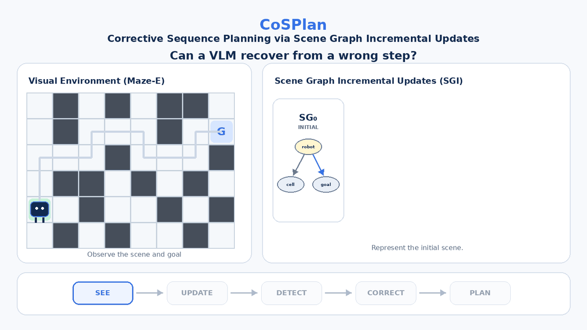

# CoSPlan: Corrective Sequential Planning via Scene Graph Incremental Updates

## Accepted at ECCV 2026

**Shresth Grover, Priyank Pathak, Akash Kumar, and Yogesh S. Rawat**

CoSPlan evaluates vision-language models on error detection and step completion across maze navigation, block rearrangement, image reconstruction, and object reorganization. Scene Graph Incremental Updates (SGI) support corrective planning through intermediate scene graphs.

## Links

[Project page](https://shroglck.github.io/cos_plan/) · [Paper PDF](https://media.eventhosts.cc/Conferences/ECCV2026/pdfs/10744.pdf) · [ECCV publication](https://link.springer.com/chapter/10.1007/978-3-032-37422-6_13) · [ECCV presentation](https://eccv.ecva.net/virtual/2026/poster/5459) · [arXiv](https://arxiv.org/abs/2512.10342) · [Dataset](https://huggingface.co/datasets/shrg7/COSPLAN) · [Code](https://github.com/shroglck/CosPlan) · [Try CoSPlan](https://shroglck.github.io/cos_plan/Forms/puzzle_quiz.html) · [Poster](https://eccv.ecva.net/media/PosterPDFs/ECCV%202026/5459.png?t=1787012377.5299084) · [Slides](https://eccv.ecva.net/media/eccv-2026/Slides/5459.pdf) · [Video](https://youtu.be/_gmbzqcxmv4)

## CoSPlan in action



## 📂 File Structure

The evaluation code is in [`code/`](code/).

* **`eval.py`** — Main execution file for evaluating a model. It handles data loading, model initialization, and the evaluation loop.
* **`models.py`** — Model-related utilities. Currently supports loading and inference for **InternVLM**, **JanusPro**, **CogVLM**, **GPT**, **Llama-Vision**, and others.
* **`prompts.py`** — Contains the basic prompts used for standard evaluation.
* **`scene_graph_analyzer.py`** — Analyzes scene graphs for Scene Graph Incremental Updates (SGI).
* **`sgi_prompts.py`** — Contains specialized prompts used for SGI.

## 🚀 Usage

### Prerequisites

Ensure you have the necessary dependencies installed and that your `datasets/` folder contains the required `_metadata.json` files corresponding to your dataset argument.

### Running an Evaluation

From the `code/` directory, run:

```bash
python eval.py \
  --output_dir ./results \
  --output_name janus_run_v1 \
  --model_name januspro \
  --dataset robovqa \
  --max_samples 10 \
  --sleep_interval 2.0
```

## BibTeX

If you use CoSPlan, please cite the ECCV 2026 publication:

```bibtex
@inproceedings{grover2026cosplan,
  author = {Grover, Shresth and Pathak, Priyank and Kumar, Akash and Rawat, Yogesh S.},
  title = {{CoSPlan}: Corrective Sequence Planning via Scene Graph Incremental Updates},
  booktitle = {Computer Vision -- ECCV 2026},
  year = {2026},
  publisher = {Springer Nature Switzerland},
  address = {Cham},
  pages = {216--235},
  isbn = {978-3-032-37422-6},
  doi = {10.1007/978-3-032-37422-6_13},
  url = {https://doi.org/10.1007/978-3-032-37422-6_13}
}
```
